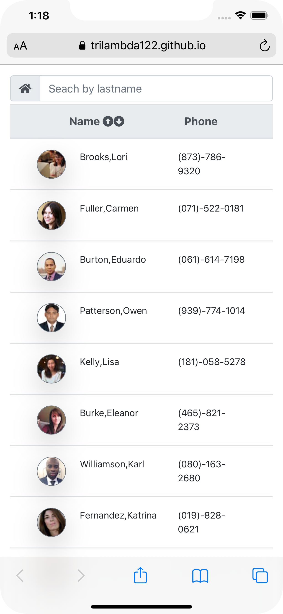
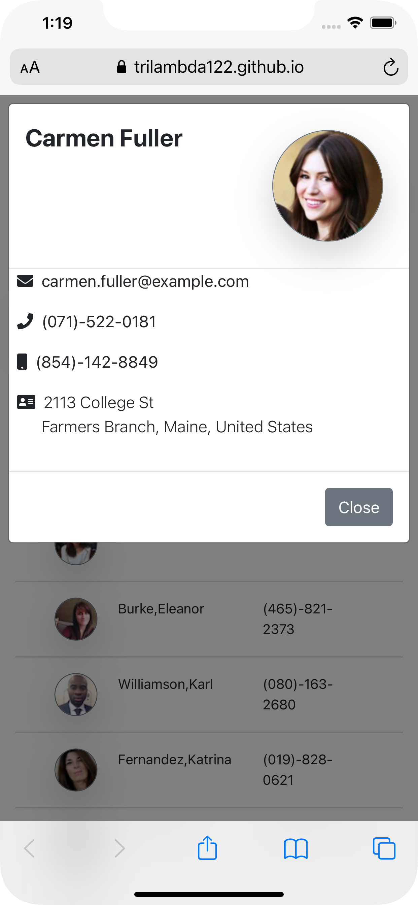
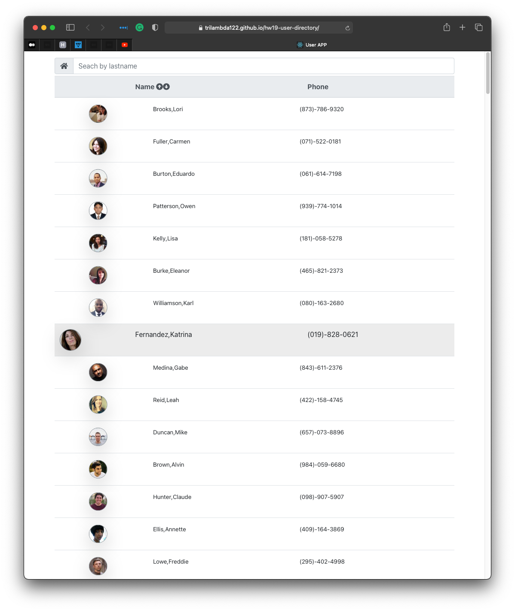
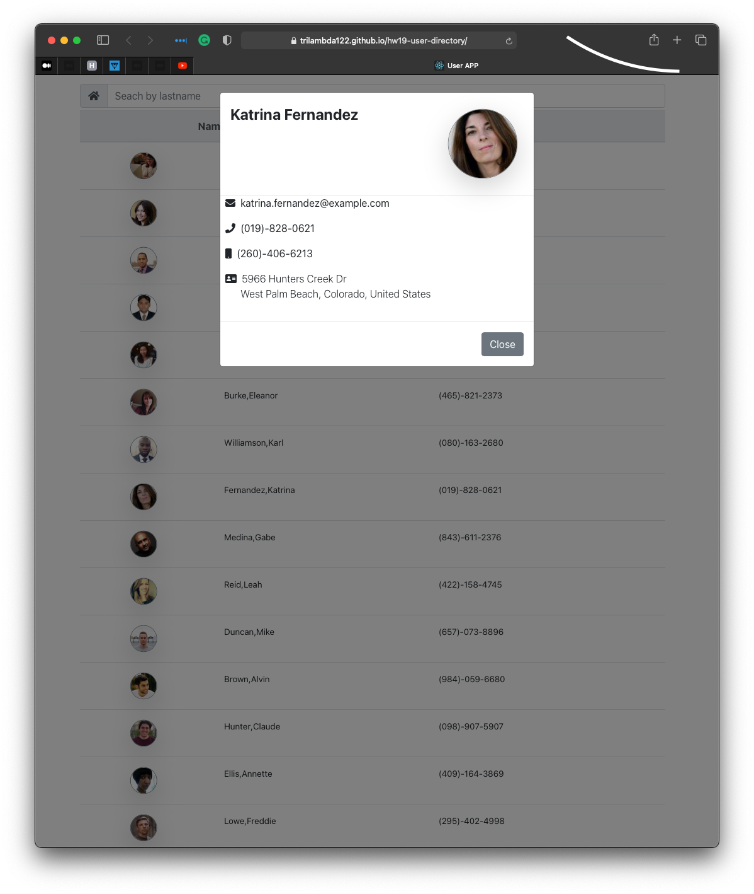

 
# Project name : USER LISTING
## Live project site can be acces here: 	[HW-19 User Directory](https://trilambda122.github.io/hw19-user-directory/)

## Project Repo [hw19-user-directory](https://github.com/trilambda122/hw19-user-directory)

---
## Table of Contents

[Description](#description)...

[Installation Requirements](#installtion-requirments)...

[Useage](#useage)...

[License](#License)...

[Contribitors](#Contribitors)...

[Tests](#Tests)...

[Questions](#Questions)...

[Application Screen Shots](#ScreenShots)...

---
## Description

User directory application using react framework. Application includes the ability to sort and search. 
Application includes some hover effects 

---

## Installtion requirments
npm install

---
## Useage
In the project directory, you can run:

### `npm start`

Runs the app in the development mode.\
Open [http://localhost:3000](http://localhost:3000) to view it in the browser.

The page will reload if you make edits.\
You will also see any lint errors in the console.

### `npm run build`

Builds the app for production to the `build` folder.\
It correctly bundles React in production mode and optimizes the build for the best performance.

The build is minified and the filenames include the hashes.\
Your app is ready to be deployed!

See the section about [deployment](https://facebook.github.io/create-react-app/docs/deployment) for more information.

---
## License
NOTICE This application is covered under MIT License license.

---
## Contribitors 

Shane Schilling

---
## Tests
None at this time 

---
## Questions

Github profile can be found here:  http://github.com/trilambda122

Please direct any additonal questions to: shane@sschilling.com

---
## ScreenShots

### *MOBILE*

### *WEB PAGE*

